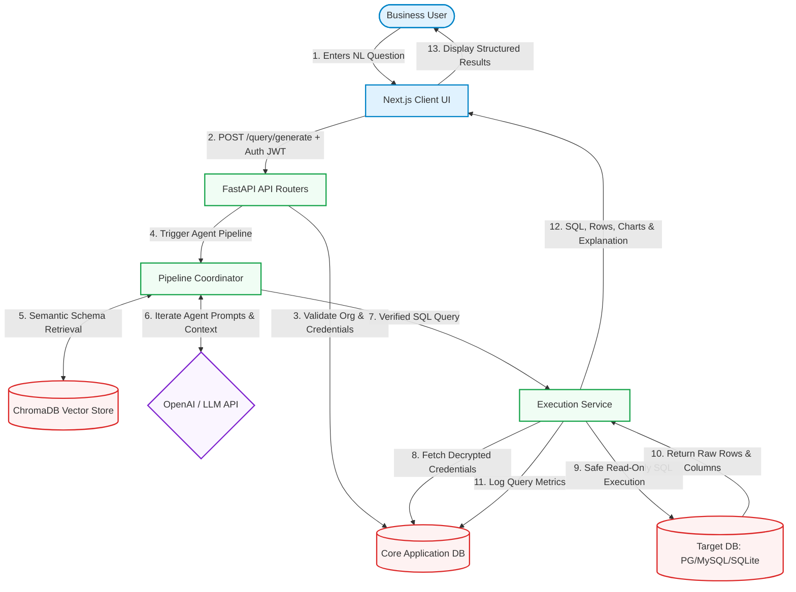
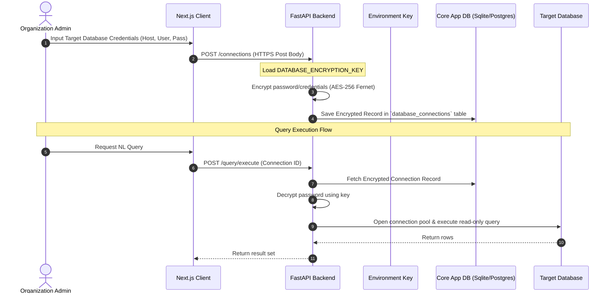

# OptiQuery AI - Data Flow Diagram (DFD)

This document maps out how data flows through **OptiQuery AI**—from a user's initial natural language query in the Next.js frontend, through the FastAPI backend and multi-agent pipeline, into vector databases for schema harvesting, and finally executing secure SQL transactions against customer databases.

---

## 1. High-Level Data Flow Architecture

Below is the structured path that data takes during a query generation and execution lifecycle.



---

## 2. Detailed Pipeline Data Flow

The backend handles natural language-to-SQL translations using a 6-stage sequential agent pipeline. Here is the data structure passing through the pipeline:

```
[User NL Input] ──> (Intent Agent) ──> (Schema Agent) ──> (Generator Agent)
                                                             │
[Paginated Output] <── (Explanation Agent) <── (Optimizer Agent) <── (Validation Agent)
```

### Stage-by-Stage Data Transformation

| Stage | Input Data | Transformation / Process | Output Data |
| :--- | :--- | :--- | :--- |
| **1. Intent Agent** | NL Question, Target Dialect | Analyzes intent (SQL vs. general chat), performs security check (SQL Injection & Prompt Injection detection). | Intent Flag (`is_sql`), Security Status |
| **2. Schema Agent** | NL Question, Connection metadata | Queries **ChromaDB** with embeddings of the question. Extracts similar tables, columns, types, and sample queries. | Schema Context (Harvested DDL & Table Descriptions) |
| **3. Generator Agent**| NL Question, Schema Context, Dialect | Constructs system prompt containing guidelines, harvested schema, and asks LLM to write the draft query. | Draft SQL Query |
| **4. Validation Agent**| Draft SQL Query, Schema Metadata | Syntactically parses the SQL. Rejects non-read operations (`INSERT`, `UPDATE`, `DELETE`, `DROP`). Ensures only valid tables are accessed. | Validated SQL Query (or syntax/security errors) |
| **5. Optimizer Agent** | Validated SQL Query, Schema Indexes | Analyzes query plan hints, validates index coverage, applies limits, and rewrites inefficient joins/subqueries. | Optimized SQL Query |
| **6. Explanation Agent**| Optimized SQL Query, Original NL Question | Prompts the LLM to generate an intuitive explanation of the SQL logic for non-technical users. | HTML/Markdown SQL Explanation |

---

## 3. Security & Credentials Data Flow

To run queries securely on customer databases, OptiQuery AI uses **AES-256 Fernet encryption** to encrypt and decrypt database credentials in transit and at rest.



> [!IMPORTANT]
> The encryption keys (`DATABASE_ENCRYPTION_KEY` and `CREDENTIAL_ENCRYPTION_KEY`) are stored exclusively in root environment variables (`.env`) and are never written to any database tables or committed to version control.
